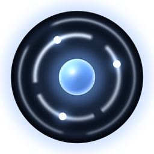
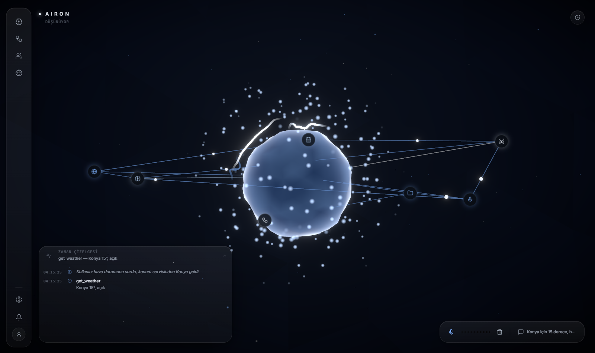

<div align="center">



# Aıron

**Sesle konuşulan, ekranı gören, kendiliğinden harekete geçen bir masaüstü yapay zekâ ortamı.**

<sub>A voice-driven AI operating environment for Windows — Gemini Live, local vision, 3D WebGL interface.</sub>

</div>

---

## Bu ne?

Aıron bir sohbet botu değil. Kendi penceresinde çalışan, sürekli açık duran bir
**yapay zekâ ortamı**: konuşarak yönetiliyor, kamerayı ve ekranı görüyor,
bilgisayarı kullanabiliyor ve bazı şeyleri sen istemeden kendisi fark edip haber
veriyor.

Arayüz gerçek bir 3D sahne — ortadaki enerji çekirdeği Aıron'un durumuna göre
davranıyor: dinlerken nabzı hızlanıyor, düşünürken sakinleşiyor, konuşurken
turkuaz-yeşile dönüyor.



---

## Neler yapabiliyor

**Ses** — Gemini Live ile Türkçe, sürekli dinleme. Mikrofon çalışmıyorsa yazarak
da konuşulabiliyor; cevap yine sesli geliyor.

**Görü** — canlı kamera, nesne tanıma ve metin okuma (OCR, Türkçe + İngilizce).
İkisi de **yerel** çalışıyor (YOLO-World ve EasyOCR), yani API kotası harcamıyor
ve internet gerektirmiyor.

**Ekran** — ekranı analiz edebiliyor ve "şuraya tıkla / şunu yaz" dendiğinde
fare-klavye ile gerçekten müdahale ediyor. Yıkıcı olabilecek her eylem **iki
adımlı onay** istiyor: önce ne yapacağını anlatıyor, onay gelmeden dokunmuyor.

**Proaktif** — "şunu izle, olunca haber ver" diyebiliyorsun; arka planda kontrol
edip kendiliğinden söylüyor. Sistem sağlığı (pil/disk/CPU) ve günlük brifing de
aynı şekilde.

**Hafıza** — kalıcı. Sana dair öğrendiklerini saklıyor, kameraya tuttuğun bir
nesneyi isimlendirip sonradan tanıyabiliyor.

**Sistem** — uygulama açma, kabuk komutu, Windows bildirimlerini okuma, güç
kontrolü, dosya arama ve içerik özetleme (PDF/Word dahil), hava durumu (gerçek
konumdan), WhatsApp, takvim, YouTube istatistikleri, video analizi.

Toplam **33 araç**. Hepsinin ne yaptığı [`Notes/Araclar/`](Notes/Araclar) altında.

---

## Kurulum

Gerekenler: **Windows**, **Python 3.11+**, **Node.js** (arayüzü derlemek için),
bir **Gemini API anahtarı**.

```bash
git clone <bu-depo>
cd Airon

python -m venv venv
venv\Scripts\activate
pip install -r requirements.txt

copy config\api_keys.example.json config\api_keys.json
```

`config/api_keys.json` içine Gemini anahtarını yaz (arayüzdeki ayarlar
panelinden de girilebilir).

Arayüz ilk çalıştırmada otomatik derleniyor; elle derlemek istersen:

```bash
cd frontend && npm install && npm run build
```

**İsteğe bağlı yetenekler** ayrı paketlere bağlı — kurulu değilse Aıron o
özelliği kapalı gösterir, çökmez:

| Yetenek | Paket | Not |
|---|---|---|
| Nesne tanıma | `ultralytics` | Model ilk kullanımda iner (~25 MB) |
| Metin okuma (OCR) | `easyocr` | Modeller ilk kullanımda iner (~100 MB) |

> `pip install easyocr` mevcut `opencv-python`'u ezmeye çalışabiliyor.
> Sorun çıkarsa: `pip install ninja lazy-loader imageio scikit-image` ardından
> `pip install easyocr --no-deps`.

---

## Çalıştırma

| Komut | Ne yapar |
|---|---|
| `AIRON.bat` | Uygulama — 3D pencere + sesli asistan, tek süreç |
| `WEB-BASLAT.bat` | Geliştirme — `npm run dev` + tarayıcı (hot reload) |
| `python desktop.py --sadece-arayuz` | Yalnızca arayüz — mikrofonu ve API kotasını meşgul etmez |
| `python make_shortcut.py` | Masaüstü kısayolu oluşturur |
| `python make_icon.py` | Uygulama ikonunu yeniden üretir |

---

## Mimari

Tek Python süreci, iki katman:

```
[WebView2 penceresi]  ──HTTP/WS──>  [FastAPI · 127.0.0.1:8000]
                                       ├── /        frontend/out (statik arayüz)
                                       ├── /api/*   REST
                                       └── /ws      canlı durum akışı

[Gemini Live] <──ses/görüntü/araçlar──> [AironLive]  ──core/web_ui.py──> arayüz
```

Ses döngüsü ve arayüz aynı süreçte ama birbirine bağlı değil: `core/web_ui.py`
arayüz yüzeyini taklit ediyor ve olayları WebSocket'e yayınlıyor. Arayüz kapalı
olsa bile Aıron konuşmaya devam ediyor.

```
main.py            Gemini Live oturumu, ses döngüsü, araç yürütme
tool_defs.py       Araçların Gemini'ye verilen şeması
actions/           Araçların gerçek uygulaması
core/              Ses cihazları, araç kaydı, arayüz adaptörü
memory/            Kalıcı hafıza
backend/           FastAPI — REST + WebSocket
frontend/          Next.js + React Three Fiber (3D arayüz)
Notes/             Obsidian kasası — nasıl çalıştığının belgesi
Docs/              Yol haritası ve yapılacaklar
```

---

## Dokümantasyon

[`Notes/`](Notes) bir **Obsidian kasası** — kodun ne yaptığını değil *neden öyle
yaptığını* anlatıyor. Girişi [`Notes/Home.md`](Notes/Home.md).

Öne çıkanlar:

- [`Notes/Mimari.md`](Notes/Mimari.md) — ses döngüsü ve olay akışı
- [`Notes/Arayuz.md`](Notes/Arayuz.md) — 3D sahne, paneller, açılış sahnelemesi
- [`Notes/Bilinen-Tuzaklar.md`](Notes/Bilinen-Tuzaklar.md) — zamana mal olmuş tuzaklar
- [`Docs/YAPILACAKLAR.md`](Docs/YAPILACAKLAR.md) — sırada ne var

---

## Gizlilik

- **API anahtarın ve hafızan depoya girmiyor** — `config/api_keys.json`,
  `memory/memory.json` ve telefon rehberi `.gitignore` içinde.
- **Nesne tanıma ve OCR yerel** — kamera görüntüsü bu işlerde hiçbir yere
  gönderilmiyor.
- **Konum** yalnızca bellekte tutuluyor, diske yazılmıyor.
- Sesli konuşma ve ekran analizi doğası gereği Gemini'ye gidiyor.

---

## Durum

Kişisel bir proje ve aktif geliştiriliyor. Çalışan her şey yukarıda; eksikler ve
sıradaki işler [`Docs/YAPILACAKLAR.md`](Docs/YAPILACAKLAR.md) ile
[`Docs/AIRON_UI_ROADMAP.md`](Docs/AIRON_UI_ROADMAP.md) içinde açıkça yazıyor.
